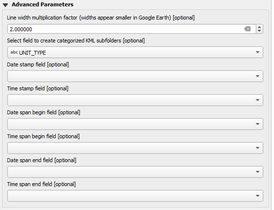

# QGIS KML Tools

The native QGIS importer creates separate layers for each folder within a KML/KMZ. If there are hundreds or thousands of layers, the import can be very slow, crash QGIS, or create an undesirable number of layers. This plugin only creates one point layer, one line layer, and one polygon layer. This makes the KML/KMZ import very quick. It adds the nested folder structure to a field in the QGIS layer which can then be used for sorting and filtering based on the previous folders in the KML. A KMZ can be exported with simple, categorized, graduated QGIS styling for points, lines and polygons.

***KML Tools*** can be found in the QGIS menu under ***Vector->KML Tools***, on the tool bar, or in the Processing Toolbox under ***KML Tools****. It has three tools.

##  ***Import KML/KMZ***
This functions as the name implies. It's interface is simple. Click on the ... button on the right of ***Import KML/KMZ file*** to select your file. Choose whether you want to include points, lines or polygons from the KML as QGIS output layers. If the KML file does not contain one of these geometry types, then the associated layer will not be created anyway.

<div style="text-align:center"></div>

##  ***Expand HTML description field***
This attempts to expand HTML tag/value pairs into separate fields. Before this can be run, the KML needs to be imported into QGIS with ***Import KML/KMZ***. Next select from ***How to expand the description field*** option one of the following:

* ***Expand from a 2 column HTML table*** - If the KML has a description entry that contains an HTML table with two columns were the first column represents a table or field name and the second column its value, then this option will parse these fields and add them to a new attribute table field.  This is an example of data that it expands.

```
    <table>
        <tr><td>City</td><td>Provo</td></tr>
        <tr><td>State</td><td>Utah</td></tr>
    </table>
```
* ***Expand from "tag = value" pairs*** - If the KML has a description entry that contains "tag = value" entries separated by new paragraphs, line breaks, or entries in a single table column, then this option will parse these fields and add them to a new attribute table field. This is an example of data that it expands.

```
    <b>City<b/> = Provo<br/>
    <b>State<b/> = Utah<br/>
```
* ***Expand from "tag: value" pairs*** - If the KML has a description entry that contains "tag: value" entries separated by new paragraphs, line breaks, or entries in a single table column, then this option will parse these fields and add them to a new attribute table field. This is an example of data that it expands.

```
    <b>City:<b/> Provo<br/>
    <b>State:<b/> Utah<br/>
```

This can either be run from the menu, tool bar, or *Processing Toolbox*; however, running it from the menu or tool bar provides user interaction during the conversion to select which fields they want to expand. During expansion some of the expansion names may already exist in the table. If that is the case then an '_' followed by a number is appended to the end.

<div style="text-align:center"></div>

Select the input layer and the field that has an HTML table of tag/value rows. Press ***OK*** and it will look through all records and find all possible tag values. If it finds tags, then it will pop up a menu for you to select which tags you want expanded into table entries like this.

<div style="text-align:center"></div>

The ***Processing Toolbox*** version of ***Expand HTML description table*** operates a little differently because processing routines cannot be interactive. In this case it will expand all possible tags that are found. Optionally, you can include a list of name tags you want expanded if you know them ahead of time. This is the Processing expansion dialog box.

<div style="text-align:center"></div>

Because there is no standard way of including additional information in the KML description entry, it is difficult to come up with a way to expand all cases. Right now this just works with two column HTML tables, ***tag=value***, and ***tag: value*** pairs, but please let us know if there are other description formats that you would like us to tackle.

##  ***Export KMZ***
This provides the ability to export a QGIS point, line, or polygon layer as a Google Earth KMZ file. It can export single, categorized, and graduated QGIS symbology. For others it will default to not exporting the symbology. For points it captures the entire symbol, but for lines and polygons only simple line colors, line widths, and solid polygon fills can be exported due the the limitations of the KML specification. It can export date and time in one or two fields as a time stamp, time begin and time end. It also handles altitude either from QGIS Z geometries or from an attribute field and eventually add a constant quantity.

<div style="text-align:center"></div>

The following describes some of the functionality.

* ***Name/Label field*** - This is the name or label that will be displayed in Google Earth.
* ***Description fields*** - By default all fields are selected to be included in the KMZ. When the user clicks on a placemark in Google Earth, these fields will be displayed. If only one field is specified then it will be treated as a description field.
* ***Export style for single, categorized, and graduated symbols*** - Select this if you want to export the QGIS style information to KML. Note that for lines and polygons, you can only use simple styles. If the style is not single, categorized, or graduated, then no style information will be exported.
* ***Point layers: Use the following Google icon, but use QGIS icon color and size*** - Rather than display the QGIS icon shape, you can select one of the Google Earth icon shapes to be displayed for point features. The size and color of the icon will be determined by QGIS.
* ***Specify whether to include altitude in the KMZ*** - If altitude is available in the QGIS geometry as a Z attribute or is available in the attribute table, then it can be included in the KMZ. Note that the altitude value must be in **meters**; otherwise, it will not be displayed correctly. The KML Altitude Mode also affects how altitude is interpreted.
* ***Default altitude mode when not obtained from the attribute table*** - When altitude is not obtained from a field in the attribute table, then this value is used.
* ***Altitude mode field*** - Specify a field in the attribute table to be used as the altitude mode.
* ***Altitude field*** - Specify a field in the attribute table to be used as the altitude. This value must be in meters.
* ***Altitude addend*** - Specify a quantity to be used as addend for altitude (from Altitude field or Z attribute). This value must be in meters.
* ***Date/Time stamp field*** - This specifies a field in the attribute table that contains a date and time. This can be a QGIS QDateTime field, QDate field, QString field, int or double field. It attempts to smartly parse any string field. If the field is an int or double then at assumes the value is EPOCH time in seconds. In the advanced parameters, separate date and time fields can be used.
* ***Date/Time span begin field*** - This selects a field for the date/time span begin field.
* ***Date/Time span end field*** - This selects a field for the date/time span end field.

**Advanced Parameters**

<div style="text-align:center"></div>

* ***Line width multiplication factor*** - Line widths in Google Earth visually appear smaller than in QGIS so this provides a method to make them look similar. By default this is set to 2.
* The rest of the advanced parameters allow the use of separate date and time fields to be combined into a single KML time stamp, time span begin, or time span end field.

KML Tools does not implement the entire KML specification. It focuses on point, line and polygon geometries within the KML. If for some reason you find that it is missing something, let us know and perhaps we can add it.
